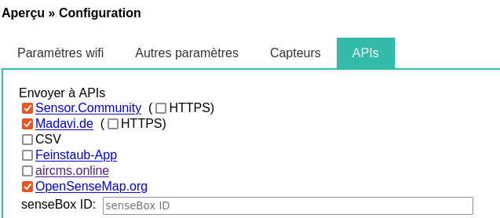

# Configuration Open Sense Map

Seconnecter avec le compte de l'atelier sur la [plate forme](https://opensensemap.org/).

Puis `New senseBox`.

Name of your station: `Ajouter le nom qui à été attribuer à la station`
Exposure: `outdoor`
Group identifier: `ATSO`

## Geolocalisation

Latitude / Longitude: 
Je ne connais pas mes coordonnées GPS? [Je peux les trouver ici](https://www.coordonnees-gps.fr/conversion-coordonnees-gps).

## Hardware

Selectionner: `Luftdaten.info dust particle sensor (SDS011) with BME280 (Ou DHT22`).

## Configuration du capteur

Une fois le capteur crée sur la plateforme, copier le senseBox ID et aller sur la page d'administration de votre capteur.

Cocher l'option OpenSenseMap.org et coller le senseBox ID dans le champs prévu.
Patientez le temps que les données remonte.
