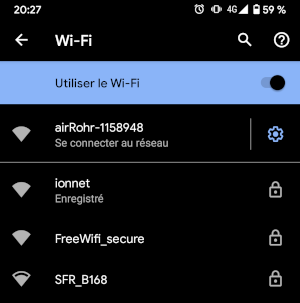
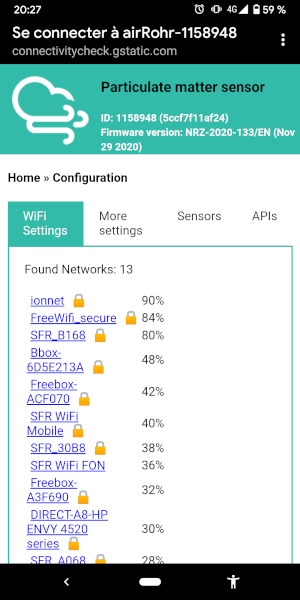
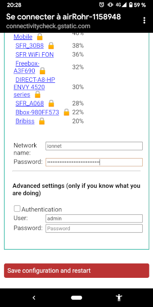

# Configuration du capteur sur votre réseau WiFi

Prérequis:

- Un capteur Aereni.
- Un smartphone ou un PC avec WiFi.

## Procédure 

- Branchez le capteur sur la prise secteur.
- A l'aide de votre smartphone ou PC, connectez vous au réseau `airRohr-XXXXXX` crée par le capteur (il peut mettre quelques secondes pour s'afficher).

- La page de configuration du capteur s'ouvre automatiquement.
- Sélectionnez votre réseau WiFi (Dans mon cas, `ionnet`).

- Saisissez ensuite le code de votre réseau WiFi puis terminez pas `Save configuration and restart`.

Dans le cas ou le capteur n'arrive pas à se connecter a votre réseau WiFi, il va à nouveau recréer le réseau WiFi `airRohr-XXXXXX`.

## Vérification du bon fonctionnement

Vous pouvez vous rendre sur les portails [OpenSenseMap](https://opensensemap.org/) ou [Sensor Community](http://maps.sensor.community/) pour voir si les données s'affiche. Prévoir un délais de quelques dizaine de minute.

Également via la page dédié de [l'atelier](https://atelier-solidaire-saint-ouen.org/)
